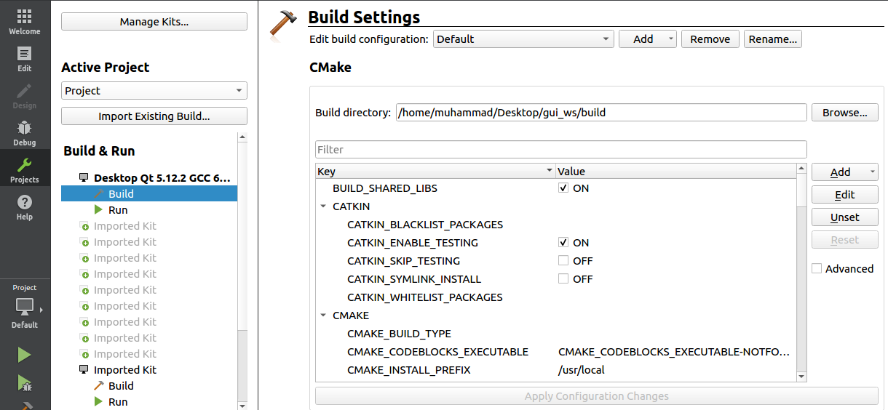

# ros-camera-gui 

Camera GUI in ROS with Qt5/C++

# For user:

# 1- Install Qt5:

`sudo apt-get update`

`sudo apt-get install qt5-default` 

`sudo apt-get install qtcreator`

# 2- Download the support packages:

`sudo apt-get install ros-kinetic-qt-create`

`sudo apt-get install ros-kinetic-qt-build`

# 3- Steps to rebuild your workspace:

* Copy the folder 'qtros' to your catkin workspace src folder.
* check in the qnode.cpp the topic name you would like to display, currently the topics are:
   `/ir/flir_tau2/image1` and `/ir/flir_tau2/image2`
* check in the main_window.cpp the path, where the snapshot pictures will be saved, currently the path is:
   `/media/ubuntu/demo/` . You can choose in code in which `image format (.jpg or .png)` the picture should be saved
* build the workspace using `catkin_make`
* source the workspace `source devel/setup.bash`
* run the package using: - rosrun qtros qtros or run the qtros app located in /devel/lib/qtros/ (using terminal: `./qtros`) 
* When the package is running:
	* the first tab is for ROS communications: you will get the ROS Master Url when `roscore` is running and ROS IP using `ifconfig`. 
    * suppose that the camera node and gui node are running on different computers, to establish the ROS network:
		* in the computer where camera node and roscore is running: navigate to .bashrc file `gedit .bashrc` 
		* add `export ROS_IP=<gui node Computer IP>` at the end
		* you may check how to establish ros network [at](https://www.youtube.com/watch?v=1KOrXSEDQ3k)
	* the second and third tabs are for displaying the camera pictures and offering the user following services: `start`, `stop` and `snapshot` 
	
	
```
Attention: This GUI is designed to display 16-bit grayscale images from thermal camera, if you want to modify it, follow `for developer` instructions
```

#  For developer:

 1- Install latest Qt version [from](https://download.qt.io/archive/qt/), step-by-step installation guide could be found [at](https://www.youtube.com/watch?v=XiM8yfDgc1Q&t=102s) 

 2- Go where Qt is installed `~/Qt5.12.2/Tools/QtCreator/bin` and open it using terminal `./qtcreator`

 3- To import the GUI project to QtCreator, The steps are:

* Click “File->Open File or Project”
* Load the project using its “CMakeLists.txt” in qtros package folder
* Go to `Projects` and browse in build directory to the `build` folder generated after catkin_make and choose it:



***Practical issues:*** 

* - [x] Image processing:
  * Software Architecture:


 The ROS image message is converted to an OpenCV image, the obtained image is again converted to a Qt image.
 
 Translating this in code means: when you do image processing adjust myCallback function in qnode.cpp and displayMat function in main_window.cpp :
 
- For OpenCV: try to avoid for loop (loop over an image pixel-by-pixel is slow)
- For  Qt: available Qimage formats can be found [at](https://doc.qt.io/qt-5/qimage.html#Format-enum)

* - [x] Update .ui file:
   * when you modify main_window.ui (Add new buttons, change label size ...etc), you need to `update ui_main_window.h`, the steps are:
		* save your modifications `Ctrl+S` 
		* delete `main_window.hpp` in src/qtros/include/qtros/main_window.hpp and delete the build and devel folders generated after catkin_make
		* `catkin_make` and ignore the error which will appear
		* go the `gui_ws/build/qtros` and copy the new generated main_window.hpp and paste it in src/qtros/include/qtros/
		* `catkin_make`
		* run the package and you will see now your modifications

				


