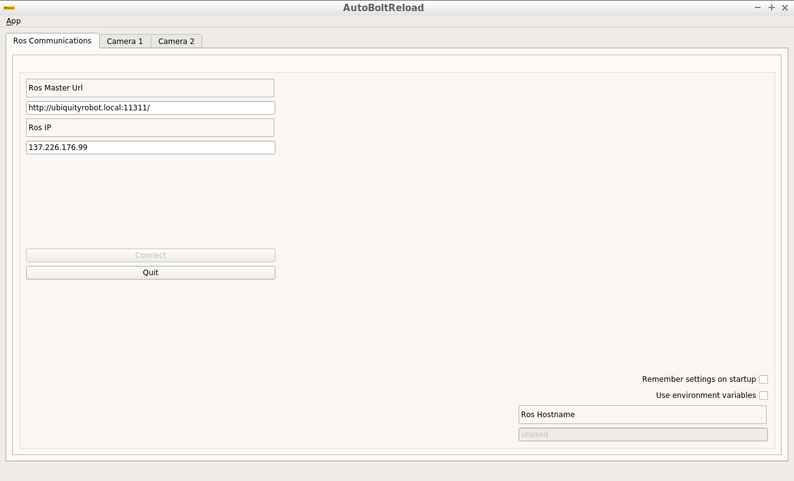
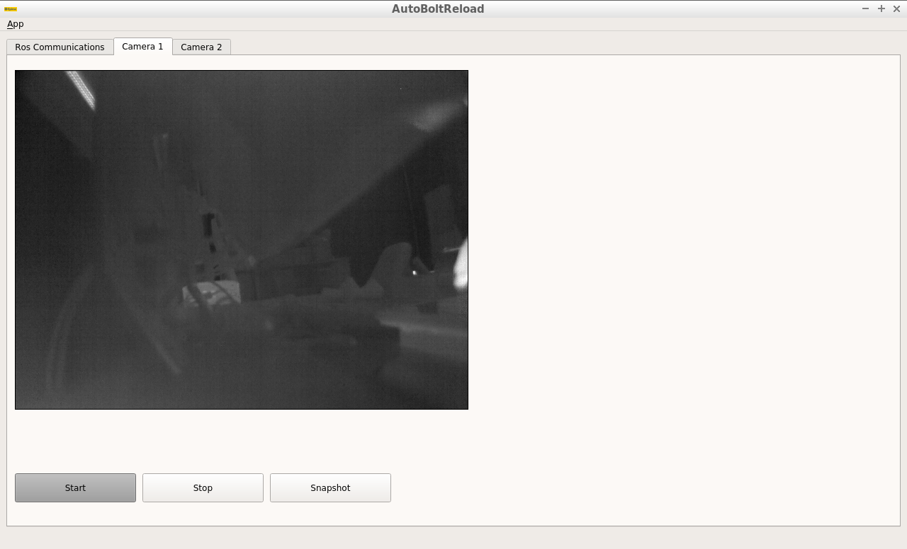
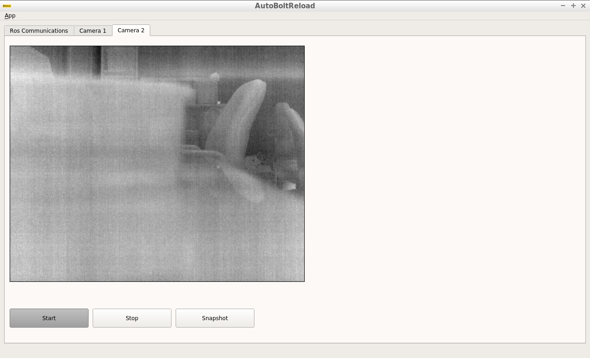

# ros-camera-gui 

Camera GUI in ROS with Qt5/C++

# 1- Install Qt5:

`sudo apt-get update`

`sudo apt-get install qt5-default` 

`sudo apt-get install qtcreator`

# 2- Download the support packages:

`sudo apt-get install ros-kinetic-qt-create`

`sudo apt-get install ros-kinetic-qt-build`

# 3- Steps to rebuild your workspace:

* Copy the folder 'qtros' to your catkin workspace src folder.
* check in the qnode.cpp the topic name you would like to display, currently the topics are:
   `/amt/ir/flir_tau2/image1` and `/amt/ir/flir_tau2/image2`
* check in the main_window.cpp the path, where the snapshot pictures will be saved, currently the path is:
   `/media/ubuntu/abr_demo/` 
* build the workspace using `catkin_make`
* source the workspace `source devel/setup.bash`
* run the package using: - rosrun qtros qtros or run the qtros app located in /devel/lib/qtros/ (using terminal: `./qtros`) 
* When the package is running:
	* the first tab is for ROS Communications: you will get the ROS Master Url when `roscore` is running and ROS IP using `ifconfig`
	* the second and third tabs are for displaying the camera pictures and offering the user following services: `start`, `stop` and `snapshot` 

# How it looks like (or similar)

